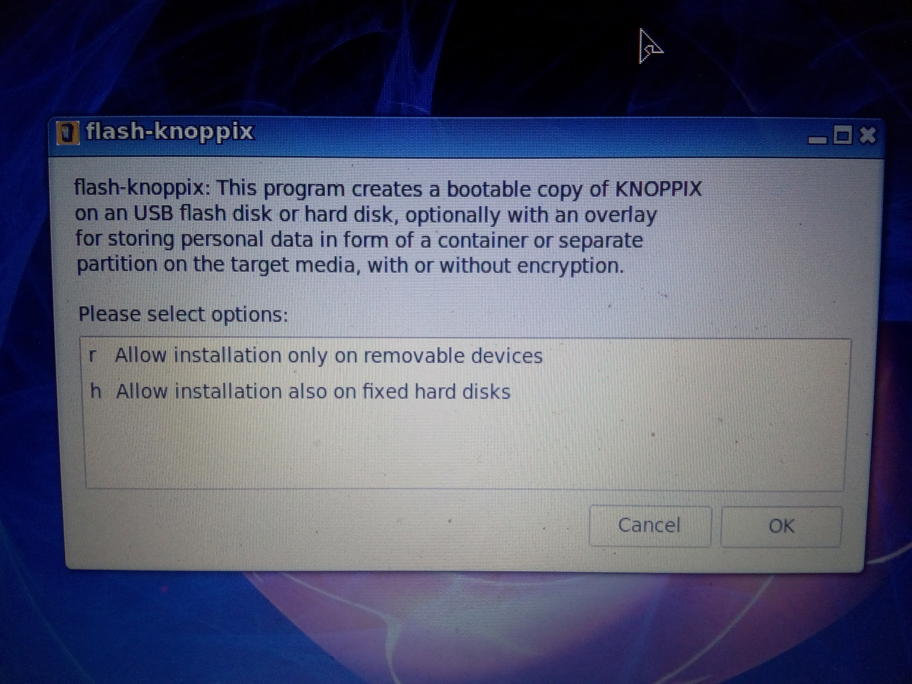

# Knoppix Installation Guide / FAQ / Discussion

One can install Knoppix to HDD as well as Flash. When installing to HDD, it will ask you for Overlay file (regardless of size). The Overlay file is like home directory of the user that can also be encrypted for security reasons. The homepage of Knopper.net doesn't discuss any details to all of this which is a pity hence I am sharing it here.

I have made a walkthrough for you while setting up Knoppix 8.6 and hope it will be useful for you.

