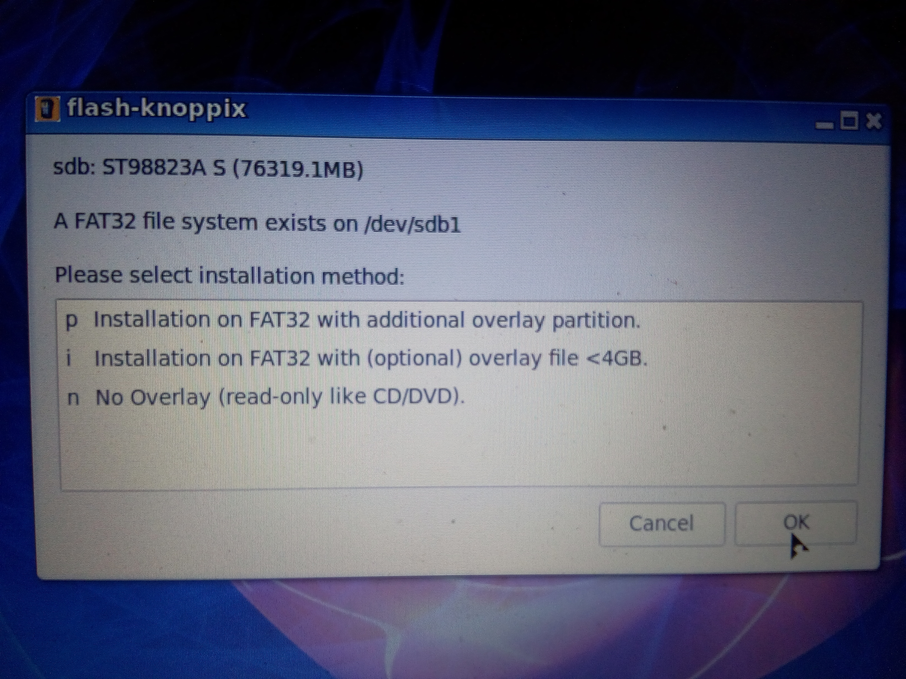
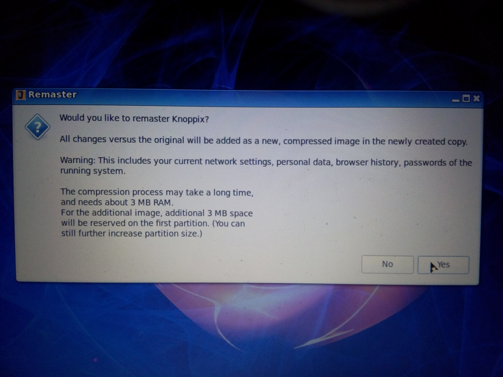
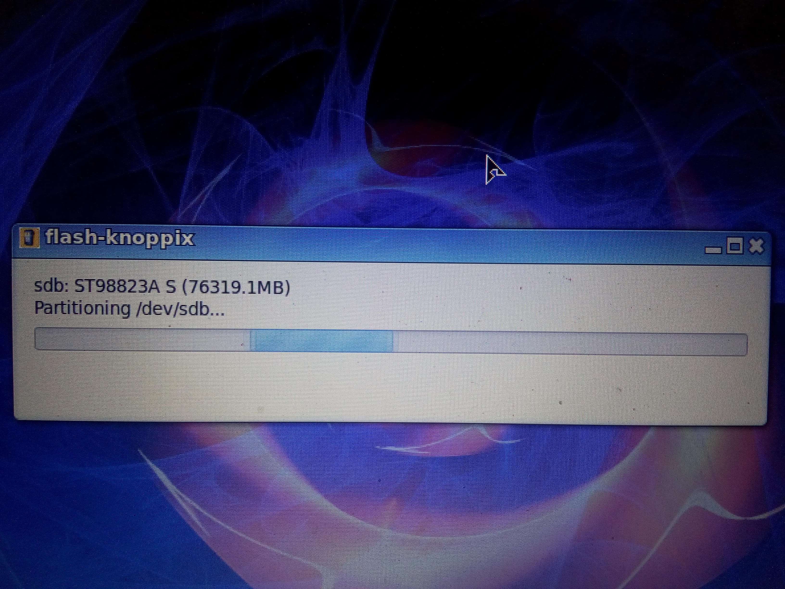
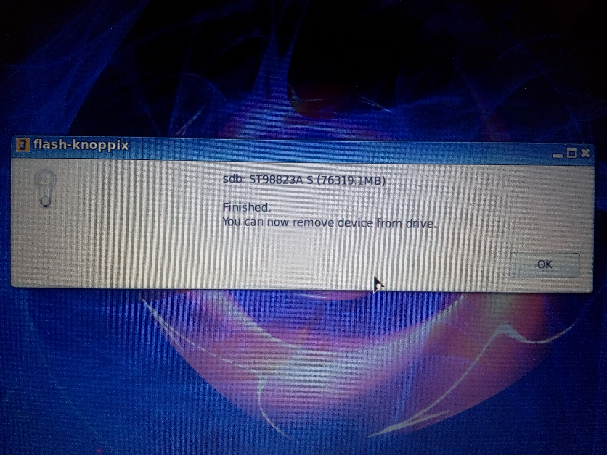
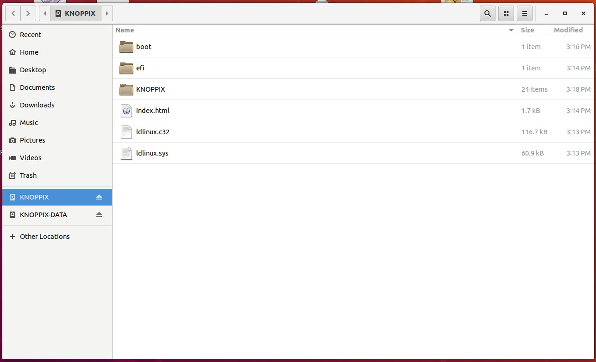
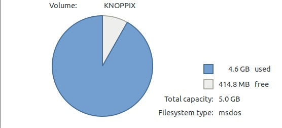
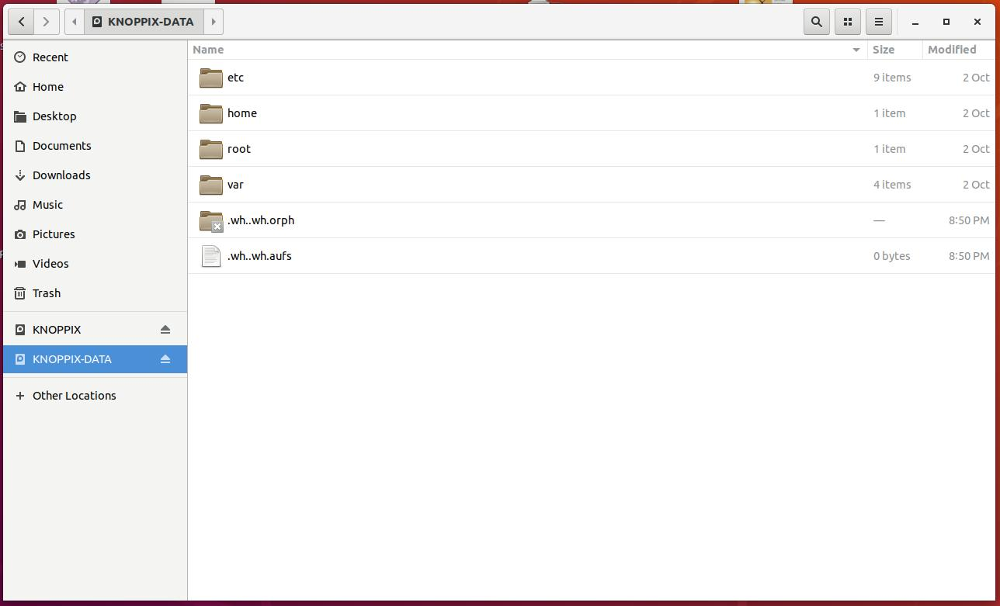
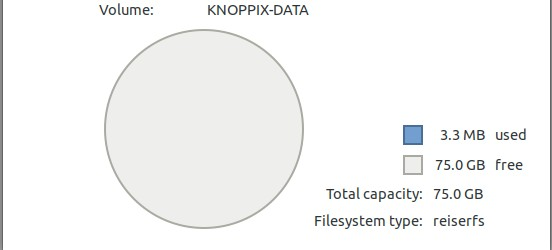

# Knoppix Installation Guide / FAQ / Discussion

One can install Knoppix to HDD as well as Flash. When installing to HDD, it will ask you for Overlay file (regardless of size). The Overlay file is like home directory of the user that can also be encrypted for security reasons. The homepage of Knopper.net doesn't discuss any details to all of this which is a pity hence I am sharing it here.

I have made a walkthrough for you while setting up Knoppix 8.6 and hope it will be useful for you.

1) This is a screenshot of my main screen after booting the Knoppix 8.6 USB:

2) See the "Flash-Knoppix" icon? Click on it and you see this:

You are able to install Knoppix to both Hard Drives and Flash Drives. I will be installing it to an external 80gb USB connected drive. So I click on the second option - h (Allow installation also on fixed hard disks). Then I see the following:

I have two hard drives, 1TB inside laptop and my external 80GB USB drive (in the bottom of list). I click on that. Then I see this screen: 

Options shown are: 
p Installation on FAT32 with additional overlay partition
i Installation on FAT32 with (optional) < 4GB file
n No Overlay (read-only like CD/DVD)

What does it all mean?
Overlay is what Knoppix defines as a location that DATA is be stored and can be ENCRYPTED

So I choose the first one (p) allowing it to create overlay in a separate partition. Will explain more. Then we see this screen:

This is asking me if I want to remaster Knoppix. Sounds complicated? I chose No because I didn't understand the screen and continued. Then this screen came, asking me for size of overlay partition. By default it choose maximum size of the drive 80gb and I clicked Ok / Accepted it. 

Then it continued with the installation

Then it asked me if I wanted to use encryption for the overlay partition

I chose No and continued till the end with no more options. 

And we are done installing Knoppix 8.6 to external USB drive (80gb).

Then I check the drive after in Ubuntu and it showed two partitions in Nautilus. The following screens show the partitions and their sizes respectively

Partition 1:

  

Partition 2:

  

Hope you find that useful!

roboirc
