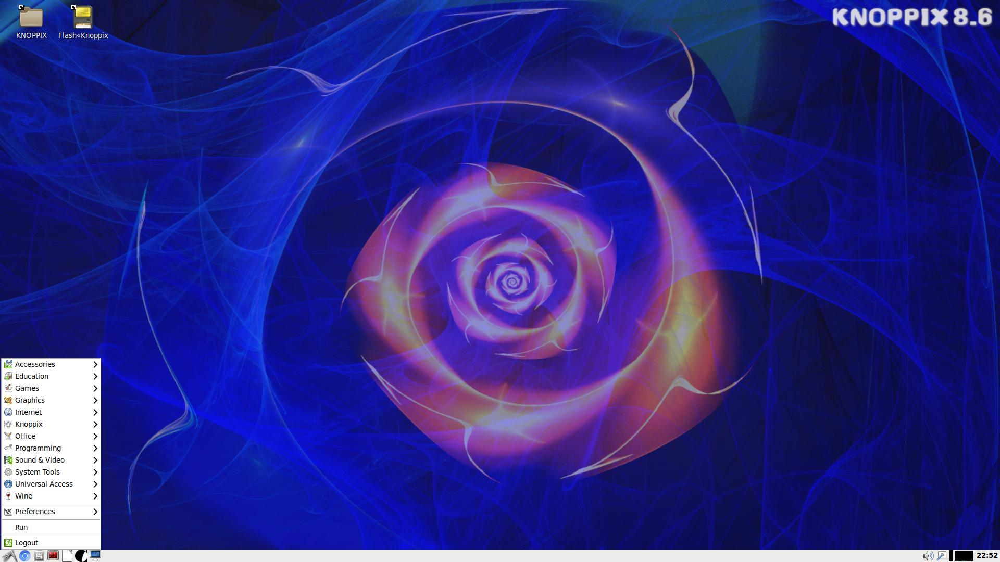
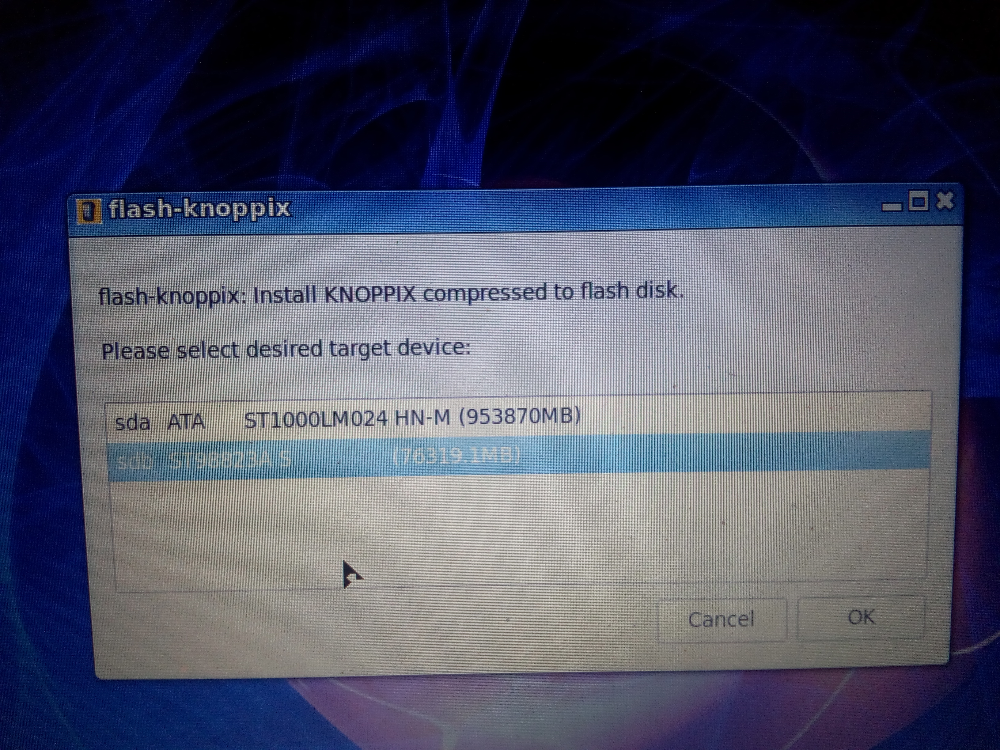

# Knoppix Installation Guide / FAQ / Discussion

One can install Knoppix to HDD as well as Flash. When installing to HDD, it will ask you for Overlay file (regardless of size). The Overlay file is like home directory of the user that can also be encrypted for security reasons. The homepage of Knopper.net doesn't discuss any details to all of this which is a pity hence I am sharing it here.

I have made a walkthrough for you while setting up Knoppix 8.6 and hope it will be useful for you.

1) This is a screenshot of my main screen after booting the Knoppix 8.6 USB:

2) See the "Flash-Knoppix" icon? Click on it and you see this:

You are able to install Knoppix to both Hard Drives and Flash Drives. I will be installing it to an external 80gb USB connected drive. So I click on the second option - h (Allow installation also on fixed hard disks). Then I see the following:

